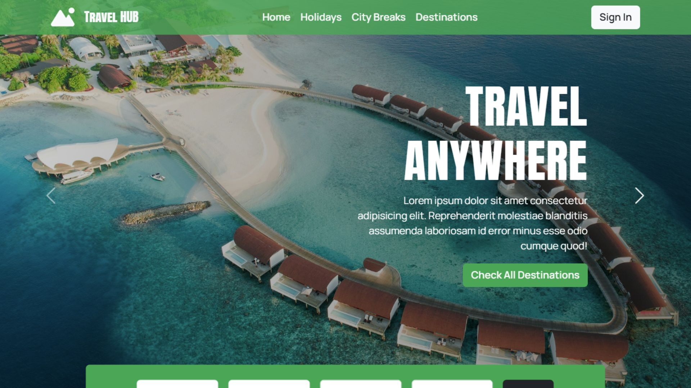

# 🌍 Travel with Mohsin

A modern and interactive travel website built using React.js as a personal portfolio project.  
This project focuses on practicing real-world UI design, component structure, and user experience instead of using a ready-made template.

---

## ✨ About the Project

Travel with Mohsin is a responsive travel discovery web app where users can:
- Explore destinations and travel deals  
- Use an interactive search form  
- Filter trips by travel style (Spa, Pool, Pet Friendly, All Inclusive)  
- View dynamic content with load-more functionality  
- Experience a custom-designed layout and navigation flow  

This project was built to simulate how a real product-style website works.

---

## 🛠️ Built With

- JavaScript (ES6+)
- React.js
- React Hooks (useState)
- React Router
- Bootstrap 5
- Custom CSS
- Font Awesome Icons

---

## 🚀 Features

- Custom hero section (no template carousel)
- Interactive search form with validation
- Dynamic filtering by travel categories
- Load more functionality for listings
- Personalized recommendations section
- Responsive layout for mobile, tablet, and desktop
- Sticky navigation bar with smooth user experience
- Clean component-based structure

---

## 🎯 Purpose of This Project

This project was created as a **portfolio practice project** to:
- Improve React component architecture  
- Practice JavaScript logic with UI  
- Build interactive features  
- Design better user flows  
- Move beyond static templates  

---

## 🌐 Live Demo

https://mohsin-react-travel-website.vercel.app/

---

## Features
- Fully responsive layout  
- Bold and clean typography  
- Icon integration with Font Awesome  
- High-quality visuals from Unsplash  
- Component-based architecture

## 👤 Author

**Mohsin Khan**  
Full Stack Developer  
Portfolio Project  

---

## 📬 Contact

Email: mohsin.codes1@gmail.com  
Location: Pakistan  
